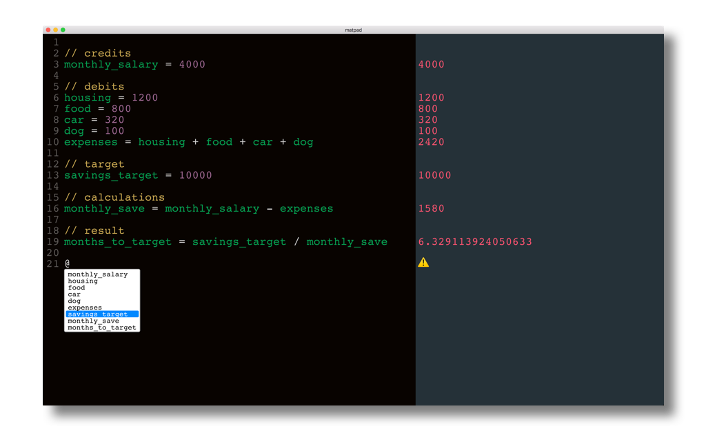

# matpad []()


> Interactive notepad for simple math



Install
------------

###### MacOS

Visit the [releases](https://github.com/hfitzwater/matpad/releases) page to download the latest version.

Develop
------------

``` bash
# install dependencies
yarn

# serve with hot reload at localhost:9080
yarn run dev

# build electron application for production
yarn run build

```
